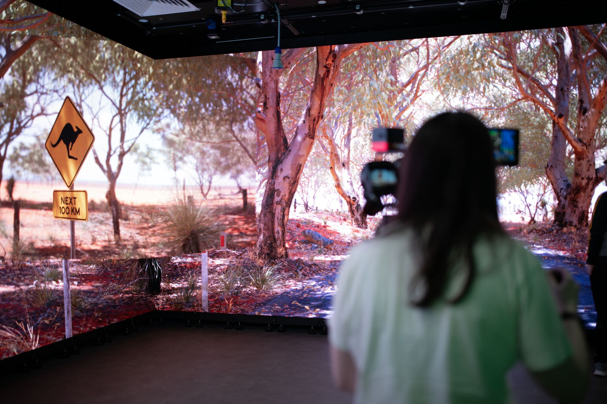

# {{ title }} Blog

## Virtual Production

Our first contemporary technology was Virtual Production, meaning we finally got to use the fabled VP Lab that I'd been hearing about since my first year on the undergraduate course.

### Ideation
From what I learned in our first class (and from prior knowledge about virtual production), I knew that I wanted to take advantage of the available brightness of the screens. I pictured a set of high-contrast scenes in a nighttime city, where street lights and signage would brightly illuminate whichever team members were burdened with being in front of the camera (luckily, not me). I also saw how the camera tracking in the VP Lab lagged slightly, making fast tracking shots difficult, so I imagined using mostly slow tracking shots and static shots, and leaving any fast tracking shots to be rendered rather than done in-camera. Given these constraints, I envisioned various shots of a driver in a car, cruising past lights that would shine off the screen, with mounted shots rendered in-engine.

    <figure style="flex: auto">
        
        <figcaption>The 'money shot' from the <i>WipEout</i> cinematic storyboard</figcaption>
    </figure>
    <figure style="flex: auto">
        
        <figcaption>Interior shot of JP listening to the race commentary just before boosting ahead</figcaption>
    </figure>

Our group got together and pitched ideas. I referenced a storyboard from *WipEout Omega Collection*'s digital art book and the opening race / "nitro scene" from *Redline* when pitching my idea. With input from Wyn, the idea evolved into an anti-gravity racing duel very like the *WipEout* storyboard, set in a brutalist city that Wyn had existing assets for. We also debated doing a *Godzilla*-style rampage scene, though we felt this would be better for the immersive green-screen in the VP Lab, so we stuck with the race idea; we ultimately didn't have access to the green-screen anyway.

### Working on the concept
Being a fan of *WipEout*, I knew immediately that I wanted our racing ships to pitch and roll with their movements along the city racecourse. I also liked the idea of actually controlling the ships, using Take Recorder to record gameplay; so, I designed a *WipEout*-esque ship controller. My main goals were to have the ship adapt to its terrain, including travelling along steep banks and perhaps walls and ceilings, and to make the ship look dynamic and weighty. 

I didn't quite achieve my goal of having the ship traverse walls and ceilings, as the rather simply thrown-together fake physics became very unstable on near-vertical surfaces. But it did handle relatively steep banks, which was enough for our needs -- we could always tweak the movement in Sequencer after recording a take. I was very happy with the dynamism of the ship; it rolled into turns, could be pitched up and down using the stick, and had airbrakes for tighter turns which created additional roll. What I was most happy with was the idle hover, where the ship would sway slightly, always rolling to counteract the sway, as if being actively balanced by its pilot or an onboard computer. I did this by using Unreal's 1D Perlin Noise function, sampling it using `Game Time` for position, and then sampling it again at `Game Time + a small time offset` for the roll; thus, the roll at one point in time would affect the position shortly after, making the ship feel real. I also set up an energy trail particle effect to throw more light into the scene.

### VR Scouting
I did set up the Quest 2 to use for VR scouting, but we found little use for it over our very brief time with the project. Personally, while I appreciated the idea, I had no issue simply flying a Cine Camera around for the same results.

### In the Lab
The VP Lab sadly did not live up to the years-long hype. The LED walls were great, but the computer driving the screens was running only one of its two GPUs, and the networked setup was very laggy, making it annoying to make changes when collaborating with teammates that were in the scene or behind the camera. The biggest issue was that the entire lab just wouldn't work sometimes, so our group only got one session to gather shots. The only shots we had with any built environment was one of my own, which we improvised with to get a few other test shots. Given the VP Lab situation, we decided early on that VP wouldn't be the project we'd take forward.

### Putting It Together
While I was focused on AR, Matt brought Conall's early engine shots up to the standard of the camera shots, then rendered them out and put them together with the camera shots to make our demo film. I was super impressed with the result, and in hindsight I'd actually have really liked taking VP forward, as I had more that I wanted to contribute to it.

## Augmented Reality

Our next project was Augmented Reality, which was a nice break from the inconsistency of VP. 

### Ideation
I wanted to keep it simple for this AR project, and my teammates had all come to similar conclusions before we even sat down together to think. Wyn suggested we make an AR version of Beer Pong and I was on-board immediately. The core game would be very simple - tap to place a table, then flick to throw ping pong balls like *Pokémon Go*. To get more out of the concept, we brainstormed mini/crazy golf-style and pinball-style additions, e.g. props that would sit on the table making it harder to land shots, and a scoring system where players could take a risk to throw their ball through extra targets that would reward additional points.

### Development
I had a very poor time working on an Android game in my second year of undergrad, so I wasn't looking forward to working on another. However, we were given an AR template that got us up and running very quickly, and I had a basic gameplay prototype up and running in the first class. That assured me that this project would go more smoothly; but, iterating on the project was still a pain due to the build process, so I dedicated some time to setting up a proper Android development pipeline. 

My research led me to Zen Streaming, Unreal's system for rapid iteration on external devices. I set up new build pipelines for cooking changed content and caching it in Unreal's Zen Store, and for packaging a 'shim'/'wrapper' app to install on my phone. The shim app contains no game data or assets, instead it streams cooked data from the Zen Store to run the game. This massively sped up the iteration cycle of the game: the 2-3 minute long process of packaging a new APK and installing it had now been streamlined down to a 10-15 second cook, with no repackaging or reinstalling necessary. I'm very happy to have experience with Zen Streaming under my belt now.

Work slowed on the project as our team collectively decided that this project would be the one we would take forward and submit, and I dedicated more of my time to other modules. I intended to have more of the game completed, e.g. the pass-the-phone multiplayer and the scoring system, but this was ultimately left to the end of the module.

### Some Silly Tech Art 
I spent a perhaps unreasonable amount of time making animated bubble effects for the logo and UI of the game. My approach here was similar to previous work I did rendering rain droplets in Unreal and Blender, but I used my newfound knowledge of the free software Material Maker to generate the required textures. I generated a texture of randomly distributed circles with random grey values, as well as normalmaps of spheres with the same random distribution, then threshold the grey circles texture with a vertical gradient. This makes the circles pop in at a vertical location corresponding to their grey value, where darker circles appear first, and lighter circles only appear higher up. I could then scroll this texture along the gradient to make the bubbles move upwards, with new bubbles popping in as it scrolls. I was happy with this initially, but when it came time to demonstrate the game in week three, I found out that the bubbles were barely visible on my device and on the projector. And then, fittingly, the game did not work at all -- a huge regression from the much better state that it was in on week two.

### Back to Development
In fixing the issues that derailed our week three demo, I realised that the structural changes I'd made on top of the provided AR framework were just plain bad. I did a significant rewrite on what I had, consolidating a lot of the code into the player pawn class - usually I avoid this kind of monolithic structure, but in this case it made sense and was easier to debug. Additionally, all of the work that I'd left for myself to do later needed done now, which was not a particularly wise move by my past self. I scrambled to program everything that still needed done, but between hand-ins for other modules, being bogged down in UI work and laptop troubles that prevented me from even opening Unreal, I lost a lot of time and ended up very behind on my goals. I'm not particularly proud of the final AR product: I didn't leave myself enough time to implement the more unique mechanics that my team had brainstormed, so the resultant game was bland.

## Brain-Computer Interfaces

The last contemporary tech project was on brain-computer interfaces. I was immediately intimidated by this project due to its complexity, and I'll admit I was quite reluctant to wear the electrode caps as they required using a conducting gel that I didn't want in my hair.

### Ideation
The very long introductory lecture made it clear that the actual brain-controlled element(s) of our games would need to be very simple actions, like blinking or turning/tilting left or right. We were also shown examples of other games incorporating BCI controls, one of which was a traditional keyboard & mouse first-person game, but with a mechanic that required the player to pause and focus to perform an action using BCI. Our game would later follow this same design pattern.

We settled on the rather silly concept of spoon-bending, which I thought fit well into the restrictions we had: most of the gameplay would use keyboard & mouse, but the player would pause and focus to imagine a crushing action (or more concretely, imagine balling up their hand into a fist). One thing led to another, and our idea became invading (in)famous illusionist Uri Geller's home to bend all of his spoons. Games truly are an art form.

### Not really getting anywhere
I consulted with Sarshar early to clear our idea and confirm that the BCI caps we had access to would work for this idea. The caps we were first shown would handle this fine, as they had lots of electrodes and thus could read brain activity at many locations to detect more complex behaviours; however, there were only two of these caps, and we didn't actually get to use them in any of our classes. Instead, we were shown how the signals from the BCI caps were read and interpreted as control inputs in Unity. I was... not blown away.

I did a little bit of investigation of my own and found a [BCI demonstration in Godot](https://medium.com/@nerveinvader/controlling-godot-with-brainwaves-in-less-than-100-lines-of-code-4465982a21eb), my engine of choice for short-term projects. If I had been working solo on these projects then I'd have switched from Unity to Godot immediately, but I'd already hogged most of the programming work for myself in the other projects and Matt and Conall were proficient in C#, so I didn't try switching the team over.

Only in the third week did we get access to BCI caps, and they were different to the ones we were shown in previous classes. These FlexEEG caps from NeuroCONCISE (a company founded by UU Magee staff) are much simpler and have only seven electrodes.