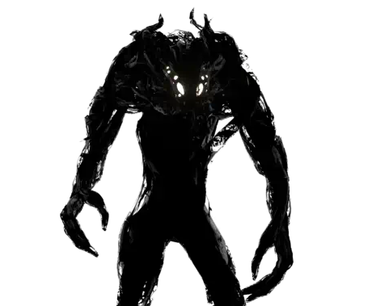

# {{ title }} Blog

## Preamble
I don't know who will read this. I don't know if *anybody* will read this. Really, I am mostly doing this for my own sake, to bookend this project and give myself closure. I rarely do that. But, I have this site set up to be more streamlined than ever for writing to, and I'm waiting for thousands of unused assets to be deleted from my project before I zip up my project files, so why not? If you do read this, then thanks! If you're a bot somehow scraping this page despite the fact that my homepage won't link to it and I have no sitemap, then: fuck off!

## In the beginning...
At first, my struggles were purely technical. This is not actually the truth, but the fact that that sentence was the first I wrote in this whole blog is indicative of a few things about this project and about me. 

I knew (or thought I knew...) that I wanted to recreate the 'Looking Glass' screens from *Prey*. I didn't know why. I think I wanted a gameplay hook that I could also use to tell a narrative. Perhaps the player was a Volunteer (read: prisoner from a Siberian gulag flown up to the space station against their will) who would be deceived by the screens, tricked into thinking they were still on Earth, until a pivotal moment in the level where the illusion is quite literally shattered and they must try to escape. Did I actually have that idea at the time? Nope!

### Screens
I spent most of my time in late November / early December on the task of recreating the screens. I was relatively confident as I'd made a portal mechanic a few times, and this time, I didn't even need to be able to walk through them! The basic setup was fine, as I expected. The problems came when I needed to make the glass smash; I needed the glass to be pre-smashed, then activate the simulation when a force was exerted on the screen, e.g. from a melee attack or a gun. I learned how to use the non-destructive mesh toolkit Datasmith to create a pipeline for pre-smashing the glass, which was really cool! Though, as per usual, the documentation was thin and/or wrong and options weren't doing what I expected, so I had to experiment. I landed on using four Anchor Fields to set the Anchored state on the perimeter fragments of the pre-smashed glass, as setting the Anchored state on perimeter pieces within Datasmith wasn't working. I also had some issues with exerting forces on the glass to make it break. I went back and forth for *days* on configurations for the glass to try and make it respond to forces without also completely falling apart when touched. 

I spent a truly unreasonable amount of time on the glass material and, by extension, the rendering pipeline. I went back-and-forth on using Forward Rendering for a few reasons: improved VRAM usage and the availability of MSAA and Alpha to Coverage were pluses, but I then discovered that ambient lighting via cubemaps on PostProcessVolumes did not work at all in the Forward Renderer, so I had to go back to the Deferred Renderer. How boring. 

It's a shame too, because Alpha to Coverage solved my problem with broken glass, namely the rendering of many shards of glass. The deferred pipeline just couldn't handle this nicely: shards would constantly Z-fight and render in the wrong order, no matter what settings I used. Alpha to Coverage solved this problem by effectively rendering a checkerboard of translucency and then using MSAA to blur the checkerboard into a kind of fake translucency, which had no issues with sorting. It did have downsides: surfaces could only be 25%, 50% or 75% translucent, and these translucencies would not add together, i.e. two 50% translucency shards on top of each other did not make a 25% translucent surface, so the shards always looked flat. I didn't mind this for my use case, but I couldn't use it anyway, so whatever. I'll get to use the Deferred Renderer for realsies one day.

Finally, I put together some C++ to handle render targets for the screens. Or... I tried to. To try and minimise memory usage, I envisioned a system where a pool of render targets would be managed and dynamically assigned to screens when they became visible. But why stop there? What if there were pools of render targets at a variety of resolutions, e.g. full-res, half-res, quarter-res, and then the manager could assign render targets based on the relative size of the screens too? That would let me have *loads* of them! But I couldn't get this to work nicely, so I ended up sticking to a simple system that created render targets when they were needed.

## The Mistake
So, with my mechanics created (even though I wanted several other things, like the platform-making Gloo Gun, perhaps some enemies, etc., so I wasn't really done), I set about making the level. Step one: find assets. Yes, that's step one, what else would I do first?

I thought I was in luck fairly early, as I found a kind of 'Space Museum' asset pack with lots of wood-on-brass-on-steel, echoing the 'Neo Deco' of *Prey*. But I found it limited and I worried what it would be like to work with; it appeared to just be some other team's Unreal project zipped up, meaning it was disorganised and definitely dodgy for me to be using. 

So, I thought...

<blockquote>"Why don't I just use the real assets from <i>Prey</i>?"</blockquote>

### Ripping from Prey
I made progress on getting assets out of *Prey* fairly quickly. Tools already existed for extracting assets from CryEngine games; one I relied on from the very beginning of the project to the very end was Markemp's cgf-converter, a program originally designed for extracting mechs from MechWarrior Online. For now, I stuck to its default settings, meaning it output COLLADA files which Blender handled fine.

However I quickly ran into a rather large problem: Unreal uses the metallic-roughness PBR workflow, whereas CryEngine uses specular-glossiness. At first I tried to convert what I had to work in Unreal's metal-rough system, using a Python script to write a new metallic texture using the specular colour texture and some maths that I found in Unreal's own SpecGlossToMetalRoughness node that it uses when importing spec-gloss assets. I ran this script within Blender so that it could also handle reexporting the files to glTF files, which meant it took *forever* to process the thousands of files that I had extracted from Prey.

The thing is, this PBR pipeline swap would only work if the materials were truly physically-based, and here, they were not. I was getting awful looking materials out of the process. Transitions between metal and dielectric surfaces became harsh and noisy, and semi-reflective surfaces like paint and rust were rendered completely and utterly wrong. I would eventually find a solution to this problem, but not here and now.

I was also having trouble with skeletal mesh assets. This was partly due to the tools I was using, and also my understanding of how to use them. Yet again I would not solve this issue for a long time...

I spent days agonising over the assets I had ripped rather than thinking about my level. I became obsessed, and that obsession would not go away until finishing the project. 

## Making the level...?
I justified the weeks I spent ripping assets by thinking that, while I worked to solve these problems, I'd subconsciously have ideas about what I should do with the level.

This did not happen.

I must have driven my friends absolutely insane, sitting on call in December and the first two weeks of January, desperately trying to make my brain have one (1) idea. Just one. We did an online whiteboard where I tried to sketch out room plans and nail down a sequence, I streamed myself working on the level, I played chunks of *Prey* as inspiration, and yet I got absolutely nowhere. 

I downed tools to work on a submission for my other module, which I absolutely *botched* and was very disappointed in as I struggled to find a direction to go in there too. 

Back to level design, I asked for an extension, and still, I had nothing. I sat for hours in front of my computer every day trying to make any sort of progress so that I would have *something* to hand in.

And so the deadline came and went.

## Limbo
The damage had now been done. Whatever I handed in would now be capped to 50%. In the intervening months I had to dedicate more time to the current semester's two modules, so I made little progress on the level. At this point I was absolutely dreading the prospect of working on it again -- I *still* had no ideas. No core concept. I had truly never struggled with a project like this in my life. I tried to clear it out of my mind for the rest of January so I could be rested for working on the other modules (which proved to be gruelling in their own way).

## Bits and Pieces
Between working on current modules, I did make some progress on my pipelines. I discovered that Unreal's new material pipeline Substrate is a specular-glossiness pipeline, allowing me to use assets from *Prey* unaltered. This massively streamlined the process of preparing and importing assets -- deleting the badly-converted metal-roughness textures felt so good. 

I worked to create an Interchange pipeline that would handle swapping over imported assets' materials to use my new Substrate master materials, but the documentation was almost non-existent. I consulted the Unreal Source Discord server and eventually ended up talking directly to a staff member at Epic Games, who helped me get around problems I was having due to the Interchange plugin still being a work-in-progress. With this sorted out, I was able to import swathes of assets at once, with Interchange correctly creating materials -- though this was not without issue.

In March, a new major version of cgf-converter was released. It could now generate USD files and also supported importing and converting animation files, which was excellent news. I used this new version to convert all the files for the Phantom enemy, which allowed me to use it for sequences in my level.

It also let me easily convert and import the animations for things like doors, which was very satisfying to see working. Despite this whole asset process being ultimately unnecessary and not exactly conducive to greyboxing my level, I feel like I did learn a ton about rendering, asset pipelines, tooling, and the extent of my ability to procrastinate.

## Epiphany

Having now built up a catalogue of assets and a set of tools for importing more quickly, I was back to needing an idea. Yes, that's right, this whole time I'd still been stuck on what I was actually going to do. Previously the only idea I'd had was that the player should wake up in a medical bay with a Phantom standing over them, before it teleports out of the bay, then out of the room behind a window, and then away entirely. This Phantom would lure the player... somewhere. Perhaps they are lured to a Looking Glass where a twist ending inspired by *Prey* itself would play out: the player is revealed to be a Phantom themselves. But I really had no idea how to connect this beginning area and the ending area, and without that, I just could not start. 

And then it happened. While I was testing some refinements to my asset pipeline, searching for things to import and test, I found the assets for the quarantine chamber, and the idea finally occurred to me. This chamber appears in the Trauma Center in Talos 1's atrium, where scientist Trevor Young (patient zero of the whole Typhon outbreak aboard the station) is isolated. Maybe my level could be about a quarantined patient, who would be left alone by the Typhon (thus excusing the lack of combat and enemy AI). 

In hindsight this is both obvious and pretty flimsy, and as I added rooms to the level, the lack of any real elaboration on this idea became clear. But what mattered is that it got me properly started, so that I could be finished with the project.

## Getting It Done

Having spent all of my time before now working on (wholly unnecessary) pipeline stuff, the rest of the story is mostly pretty boring. Using the standardised level geometry from *Prey*, I could easily block out rooms with wall pieces, slap materials on them, and add props. 
